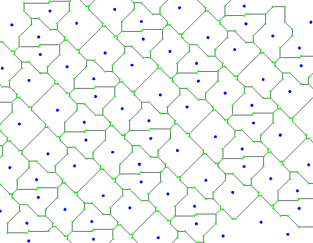
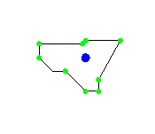
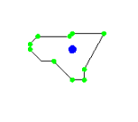
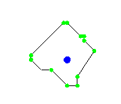
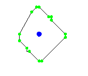
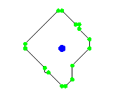
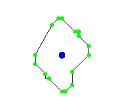

# Fortunes_Manhattan
=======
# Voronoi Diagrams in the Manhattan Metric

This project implements **Fortune’s Algorithm** for generating **Voronoi diagrams** in the **Manhattan metric**, modifying the traditional approach used in the **Euclidean metric**. The algorithm efficiently computes Voronoi cells by handling **geometric properties unique to Manhattan distance**.

## 🚀 Features

- **Efficient Voronoi Diagram Computation** in the Manhattan metric  
- **Algorithmic Modifications** to Fortune’s algorithm for non-Euclidean space  
- **Handling of Edge Cases** such as collinear points and bisector transformations  

## 🛠 Implementation Details

### **1. Finding the Voronoi Vertex (Circle Events)**
- The **center of the circumcircle** in Manhattan distance differs from the Euclidean case.
- The **algorithm adjusts bisector intersections** to determine valid Voronoi vertices.

### **2. Beach Line Representation**
- **Parabolic arcs** in the Euclidean version are replaced with **Manhattan metric edges**.
- **Sweep line events** are modified to account for discrete metric properties.

### **3. Handling Boundary Cases**
- Special handling of points **aligned at a 45° angle** where Voronoi edges form **polygons instead of line segments**.
- Additional **pre-processing filters** to ensure valid computations.

## 📊 Voronoi Diagram Comparisons

### **Euclidean vs. Manhattan Voronoi Diagrams**
**Euclidean Metric Voronoi Diagram**  

**Manhattan Metric Voronoi Diagram**  

## 📈 Results: Distinctly Different Voronoi Cells

Here are sample **Voronoi cells** generated using the modified algorithm in the Manhattan metric:

## 🏗 Future Improvements

- Optimization of **data structures** for performance.
- Further analysis of **geometric properties in higher dimensions**.

